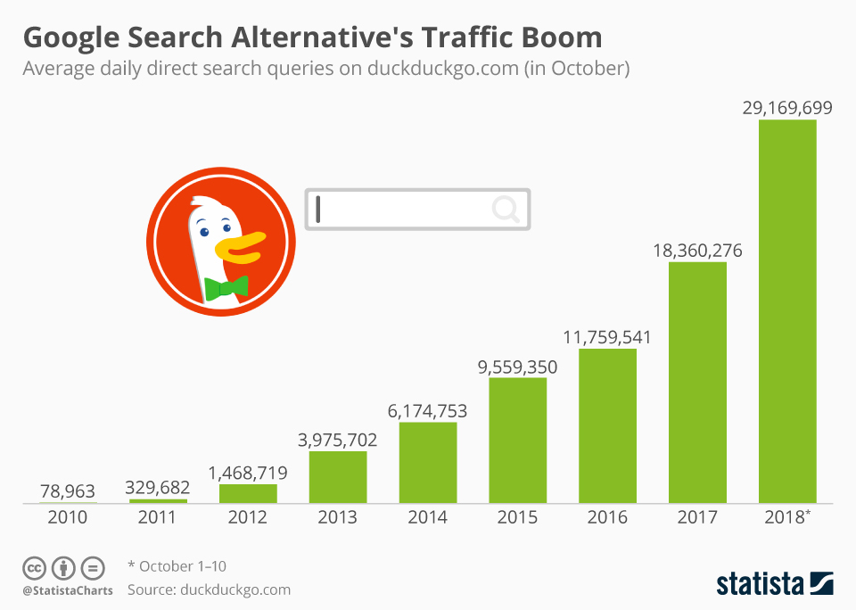

/article-new/2021/03/DuckDuckGo-vs-Chrome-Feature.jpg?lossy) 

# Google's FLoC Could Make It Lose its #1 Search Engine Title 

## What is Google FLoC?

Google FLoC is simply a design created by Google that is here to either replace or work with other third-party cookies usually found in sites that provide ad space for people with advertisements. It is still a trial thing that is ongoing with Google and the Chrome browser that is not exactly being welcomed by the tech community.

## How bad is it for user privacy?

Google FLoC is not being received with all the excitement and zeal because it interferes with your user privacy on your browser. Normally, when other sites you are not visiting want to get your browser history, they usually have to ask for permission and cannot just get access to what you are browsing.

Google FLoC has a different approach to the whole browser privacy hence the hostile reception. FLoC is pre-installed and automatically given permissions by your chrome browser to access all the pages you visit especially the advertisements you click on while on that page and the other affiliate websites you click on when on a different website.

This means that you give this feature permission to access all your web browser history while on Chrome browser. 

## What can you do to prevent your Chrome browser from sharing your browsing details with Google FLoC?
I would personally recommend you to try the DuckDuckgo Chrome extension which can easily be installed in your chrome browser to prevent sharing your information with FLoC without your consent.

DuckDuckgo has had an increasingly fast user growth past the few years making it one of the best solutions to your user privacy mishap with the Google Chrome browser.

Here is a visual representation of the increase in users over the years making it easier to vouch for its wonderful performance.

## How does Google FLoC work on your Chrome browser?

This feature works hand in hand with your Chrome browser. This means the information it gets to access is of the browser, not any personal information of the user. You may think that this little information will help with how popular the feature becomes, but this is not the case.

One of the main reasons why this feature is not favored by many is because of how the feature is automatically enabled in the browser once you use it. It does not ask for any permissions and just starts to keep track of your browser history and the websites you visit directly or indirectly by using affiliate links. 

What FLoC does is takes all browser histories for browsers that have enabled the feature with a similar browser history pattern and groups them. An example would be to take the browser history of person X who browses about cars and also take the browser history of another person Y who also browses about cars and groups them together. 

Once the feature does the grouping, usually in cohorts, the various ad websites can easily gain access to the cohorts and be able to personalize their ads to fit different browser histories. This makes the ads that get shown on the websites you visit more personal.

## Why is Google FLoC bad for Google?

FLoC reviews amongst internet users are saying that this new feature is not being welcomed in the market by the majority of internet users. The reasons why are pretty simple and all revolve around one thing; user privacy.

The only people who appreciate this new Google this feature are ad websites that get to legally access people's browser history and provide more personalized ads for the users. They can access details such as what web pages a browser has been visiting.

Most users, however, are against it because it violates user privacy and is generally not comfortable with their browsers sharing their information with other third-party apps and websites.

The above shows why Google FLoC is generally bad for the Google search engine browsers and may lead to reducing the number of users using the Chrome browsers. 
